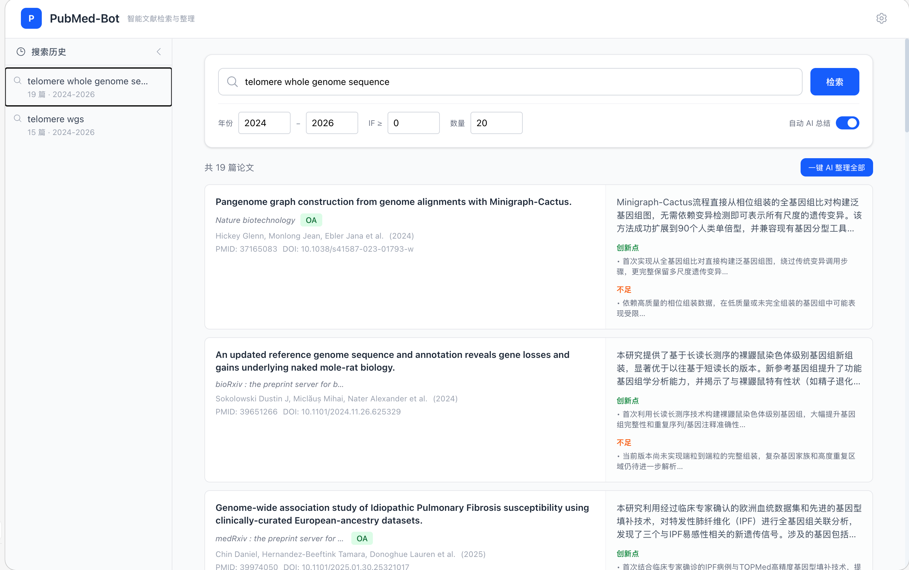
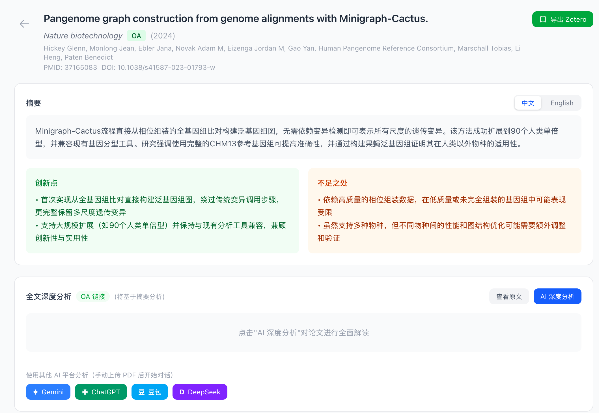

# PubMed-Bot

智能 PubMed 文献检索与整理工具。输入关键词自动检索文献、筛选影响因子、AI 生成结构化摘要，支持全文深度分析、交互式问答和 Zotero 导出。
## 搜索主页

## 文献页面

## 功能特性

**文献检索**
- 基于 PubMed E-utilities API 检索，支持关键词、年份范围、影响因子筛选
- 流式加载结果，论文逐篇展示，无需等待全部处理完成

**影响因子查询**
- 通过 EasyScholar API 获取期刊影响因子和中科院分区（如"生物学1区 Top"）
- OpenAlex API 作为备用数据源，结果自动缓存

**AI 摘要整理**
- 对每篇论文自动生成中英双语摘要、创新点和不足之处
- 支持一键批量整理和自动整理模式
- Prompt 可通过 `.env` 文件自定义

**全文深度分析**
- PMC 开放获取全文自动抓取（BioC API 结构化数据）
- Unpaywall 查找 OA 版本并自动下载解析 PDF
- AI 全文深度分析：研究背景、核心方法、主要发现、创新点、局限性
- 支持跳转 Gemini / ChatGPT / 豆包 / DeepSeek 进行外部分析

**交互式问答**
- 基于论文内容（摘要 + 全文）的流式对话
- 对话历史持久化保存

**Zotero 集成**
- 支持配置多个 Zotero 账户（个人/群组库）
- 导出论文条目及 AI 分析笔记（摘要、创新点、不足、深度分析、问答记录）
- 导出时可选择目标文件夹

**数据持久化**
- 所有检索结果、AI 摘要、全文分析、对话记录持久化存储于 SQLite
- 服务重启不丢失数据

## 技术栈

| 层 | 技术 |
|---|------|
| 前端 | React 18 + TypeScript + Tailwind CSS 4 + Vite |
| 后端 | Python FastAPI（异步） |
| 数据库 | SQLite + SQLAlchemy（异步） |
| LLM | OpenAI SDK（兼容任意 OpenAI 格式 API） |
| 文献检索 | Biopython (NCBI E-utilities) |
| 影响因子 | EasyScholar API + OpenAlex API |
| 全文获取 | PMC BioC API + Unpaywall API + pdfplumber |
| 文献管理 | Pyzotero (Zotero Web API v3) |

## 快速开始

### 环境要求

- Python 3.11+
- Node.js 18+
- npm

### 安装

```bash
git clone https://github.com/yourname/Pubmed-Bot.git
cd Pubmed-Bot

# 一键安装所有依赖
make install
```

### 配置

```bash
cp .env.example .env
```

编辑 `.env` 文件，填写必要的 API 密钥：

| 配置项 | 必填 | 说明 |
|--------|------|------|
| `PUBMED_BOT_LLM_API_KEY` | 是 | OpenAI 格式的大模型 API Key |
| `PUBMED_BOT_LLM_BASE_URL` | 是 | API 地址（支持中转/本地部署） |
| `PUBMED_BOT_LLM_MODEL` | 是 | 模型名称，如 `gpt-4o`、`qwen-plus` |
| `PUBMED_BOT_NCBI_EMAIL` | 建议 | NCBI 要求提供邮箱 |
| `PUBMED_BOT_EASYSCHOLAR_SECRET_KEY` | 推荐 | 影响因子查询，从 [easyscholar.cc](https://www.easyscholar.cc/) 获取 |
| `PUBMED_BOT_UNPAYWALL_EMAIL` | 推荐 | 全文获取，任意有效邮箱即可 |
| `PUBMED_BOT_NCBI_API_KEY` | 可选 | 提升 PubMed 查询速率（3→10 次/秒） |

Zotero 账户在启动后通过网页端"设置"页面添加，无需在 `.env` 中配置。

### 启动

开发模式需要两个终端：

```bash
# 终端 1：启动后端
make backend

# 终端 2：启动前端
make frontend
```

访问 http://localhost:5173

生产模式（先构建前端）：

```bash
make build
make serve
```

访问 http://localhost:8000

## 使用说明

### 1. 检索文献

在搜索栏输入关键词（如 `telomere aging`），设置年份范围和最低影响因子，点击检索。结果以流式方式逐篇展示。

开启"自动 AI 总结"开关后，每篇论文会在检索到后自动生成 AI 摘要。

### 2. 查看论文详情

点击论文卡片进入详情页，包含：

- **摘要面板**：中英文切换、创新点、不足之处
- **全文深度分析**：点击"AI 深度分析"生成全面解读
- **智能问答**：对论文内容提问，支持流式回答

### 3. 导出到 Zotero

点击"导出 Zotero"按钮，选择目标账户和文件夹，一键导出论文条目及所有 AI 分析笔记。

### 4. 自定义 AI Prompt

在 `.env` 中设置以下变量可自定义 AI 行为：

```bash
# 摘要整理 prompt（需输出 JSON 格式）
PUBMED_BOT_LLM_PROMPT_SUMMARIZE=你的自定义 prompt...

# 全文深度分析 prompt
PUBMED_BOT_LLM_PROMPT_FULLTEXT=你的自定义 prompt...

# 对话系统 prompt（支持 {title} {journal} {year} 等变量）
PUBMED_BOT_LLM_PROMPT_CHAT=你的自定义 prompt...
```

## 项目结构

```
Pubmed-Bot/
├── backend/
│   ├── app/
│   │   ├── main.py              # FastAPI 入口
│   │   ├── config.py            # 配置管理（含默认 Prompt）
│   │   ├── database.py          # 异步数据库引擎
│   │   ├── api/                 # API 路由
│   │   │   ├── search.py        #   检索（含流式 SSE）
│   │   │   ├── papers.py        #   论文详情 & 全文
│   │   │   ├── summary.py       #   AI 摘要 & 深度分析
│   │   │   ├── chat.py          #   流式对话
│   │   │   └── zotero.py        #   Zotero 多账户管理 & 导出
│   │   ├── models/              # SQLAlchemy ORM
│   │   ├── schemas/             # Pydantic 请求/响应
│   │   ├── services/            # 业务逻辑
│   │   │   ├── pubmed.py        #   PubMed E-utilities 封装
│   │   │   ├── journal_metrics.py #  EasyScholar + OpenAlex
│   │   │   ├── fulltext.py      #   PMC + Unpaywall + PDF 解析
│   │   │   ├── llm.py           #   LLM 摘要/分析/对话
│   │   │   └── zotero_service.py #  Zotero Web API v3
│   │   └── utils/               # 工具（限速器、XML解析、文本分块）
│   └── requirements.txt
├── frontend/
│   ├── src/
│   │   ├── components/          # React 组件
│   │   ├── stores/              # Zustand 状态管理
│   │   ├── api/                 # 后端 API 调用
│   │   └── pages/               # 页面
│   └── package.json
├── data/                        # SQLite 数据库（自动创建）
├── Makefile                     # 快捷命令
└── .env.example                 # 配置模板
```

## API 接口

| 方法 | 路径 | 说明 |
|------|------|------|
| POST | `/api/search/stream` | 流式检索（SSE） |
| POST | `/api/search` | 普通检索 |
| GET | `/api/search/history` | 搜索历史 |
| GET | `/api/papers/{id}` | 论文详情 |
| GET | `/api/papers/{id}/fulltext` | 获取全文 |
| POST | `/api/papers/{id}/summarize` | AI 摘要 |
| POST | `/api/papers/{id}/analyze-fulltext` | AI 深度分析 |
| POST | `/api/papers/{id}/chat` | 流式对话（SSE） |
| POST | `/api/papers/{id}/zotero/export` | 导出到 Zotero |
| GET/POST/DELETE | `/api/zotero/accounts` | Zotero 账户管理 |
| GET/PUT | `/api/config` | 运行时配置 |

## 致谢

- [NCBI E-utilities](https://www.ncbi.nlm.nih.gov/books/NBK25497/) — PubMed 检索 API
- [EasyScholar](https://www.easyscholar.cc/) — 期刊影响因子查询
- [Unpaywall](https://unpaywall.org/) — 开放获取论文查找
- [Zotero](https://www.zotero.org/) — 文献管理
- [PMC BioC API](https://www.ncbi.nlm.nih.gov/research/bionlp/APIs/BioC-PMC/) — 全文获取

## License

MIT
